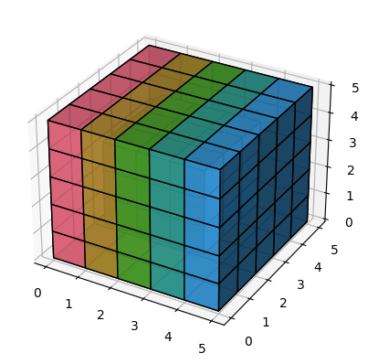
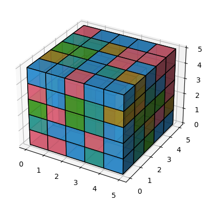

# stepstep

```python
from cube import Cube3D

cube = Cube3D(5)  # only parameter is a size of a cube

# basic interface:
cube.cube  # inner numpy structure
cube.sort_loss()  # calculate convex level of "unsortedness"
cube.plot(alpha=0.9, colors_set=None)  # plot simplified representation of a cube
cube.rotate(axi, level, clockwise=True)  # apparently, rotate the cube's side
cube.mix(n=100)  # perform `n` random rotations
```

